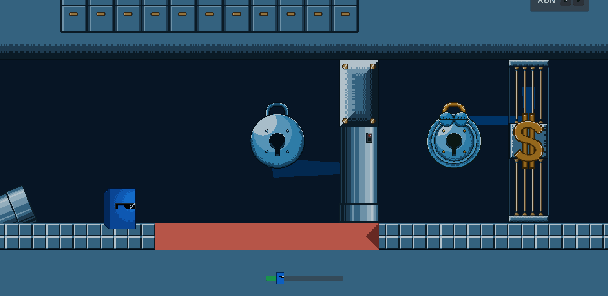

# flow

**Flow** is a combo oriented platformer that allows players freedom of movement as far as their skill is able to take them.

## About Flow

The premise is simple, just hit the key into the lock to progress onto the next level. :key: :unlock:

However you must not let the key touch the orange surfaces. :x:

Things get a bit more interesting once we start adding more keys into the mix. :key::key:

Once we add wall jumping, we can start to have a little more fun. 😈 

Levels flow seemlessly into each other, progressively increasing in difficulty. Complete them as fast as possible to earn more cash. :dollar: 

When you're finished you must hide away your money... then you're off to the next heist. :money_with_wings:

The only thing limitting your speed is yourself, go back to older levels and blaze through them with your improved skills. :clock1:

## On Difficulty Tuning

One of the biggest challanges when developing a game is finding the sweet-spot for difficulty. Make the game too hard and you risk frustrating your players. Make the game too easy and it becomes trivial and boring.

In order to tackle this issue, the game would automatically save a replay of each player's playthrough. With their consent, the replay, along with inputs and other stats, was then uploaded to an **Azure** blob storage. Here I could take a look at the replay and address any common issues players were having.

The replays, alongside explicit player feedback, helped immensely in fine tuning the game and making it more enjoyable to play. Countless levels and mechanics were discarded or reworked as a result of this, but the game turned out all the better because of it.

## Project History

### Original Development
Flow was first developed in 2018. I always thought comboing things in fighting games was fun, but wanted to bring that to a single player experience. 
Thus flow was born.

### Migration to GitHub
The project, excluding art assets, was uploaded to GitHub in 2020. This move was intended to archive the code and make it accessible to the public.
